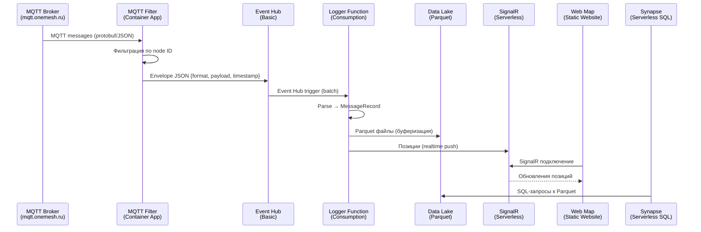

# vostoklogger_infra

Bicep-шаблоны инфраструктуры Azure для системы логирования Meshtastic mesh-сети.

## Архитектура



## Ресурсы

| Ресурс | Тип/SKU | Назначение |
|---|---|---|
| **Event Hub** | Basic, 1 partition | Транспорт сообщений между Filter и Function |
| **Data Lake Storage** | Standard_LRS, HNS | Хранение Parquet файлов |
| **Container Registry** | Basic | Docker-образы MQTT Filter |
| **Container Apps** | Consumption | Хостинг MQTT Filter |
| **Azure Function** | Consumption (Y1) | Обработка Event Hub → Parquet/Table/SignalR |
| **SignalR** | Free | Realtime push позиций на карту |
| **Static Website** | Storage $web | Web Map (Leaflet.js) |
| **Synapse** | Serverless SQL | Аналитические запросы к Parquet |
| **App Insights + LAW** | PerGB2018, 30d | Мониторинг и логирование |

## Параметры

Настраиваются в [main.bicepparam](main.bicepparam):

| Параметр | Описание | По умолчанию |
|---|---|---|
| `location` | Регион Azure | `westeurope` |
| `projectName` | Префикс имён ресурсов | `vostoklogger` |
| `mqttBroker` | Адрес MQTT брокера | — |
| `mqttTopic` | Топик подписки | `#` |
| `mqttUsername` | MQTT логин (secure) | — |
| `mqttPassword` | MQTT пароль (secure) | — |
| `filterAllowedFromIds` | Разрешённые node ID через запятую, или `*` для всех | — |
| `eventHubName` | Имя Event Hub | `messages` |
| `flushMaxBufferSize` | Макс. размер буфера перед записью Parquet | `5000` |
| `flushIntervalSeconds` | Интервал сброса буфера (секунды) | `1800` |
| `synapseSqlPassword` | Пароль SQL-админа Synapse (secure) | — |

## Деплой

### Через Azure Pipeline

Автоматически при изменении `*.bicep` / `*.bicepparam` файлов в `main`. Секреты (`mqttUsername`, `mqttPassword`, `synapseSqlPassword`) хранятся в variable group `vostoklogger-secrets`.

### Вручную

```bash
az login

az deployment group create \
  --resource-group rsgweprivate-vostoklogger \
  --template-file main.bicep \
  --parameters main.bicepparam \
  --parameters mqttUsername="<username>" mqttPassword="<password>" synapseSqlPassword="<password>"
```

## После деплоя: Managed Identity

Container App и Function App используют Managed Identity. Необходимо назначить роли:

```bash
# Event Hub Data Sender для MQTT Filter
PRINCIPAL_ID=$(az containerapp show \
  --name vostoklogger-mqtt \
  --resource-group rsgweprivate-vostoklogger \
  --query identity.principalId -o tsv)

EVENTHUB_ID=$(az eventhubs namespace show \
  --name $(az eventhubs namespace list -g rsgweprivate-vostoklogger --query "[0].name" -o tsv) \
  --resource-group rsgweprivate-vostoklogger \
  --query id -o tsv)

az role assignment create \
  --assignee $PRINCIPAL_ID \
  --role "Azure Event Hubs Data Sender" \
  --scope $EVENTHUB_ID
```

## MQTT секреты

Секреты задаются как `@secure()` параметры Bicep и передаются при деплое (через CI/CD variable group или CLI).

> Не храните секреты в `main.bicepparam` или репозитории. Изменения через Portal будут перезаписаны следующим деплоем.

